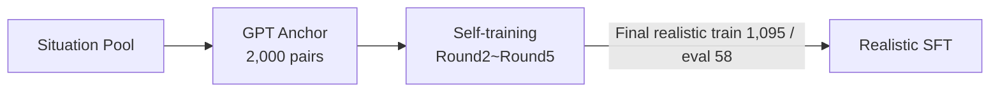
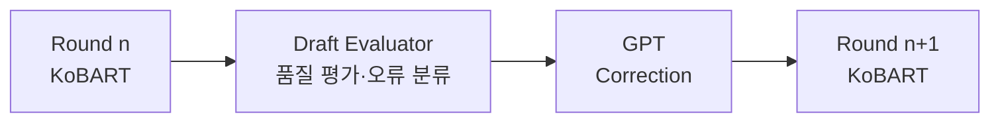

# 🌿 **Aiary – AI 기반 사진 자동 일기 생성 서비스**

## Aiary는 **아기의 사진을 올리면 자동으로 한 줄 일기와 하루 줄글 일기**를 생성해주는 AI 서비스입니다.

* 📸 **사진 → 한 줄 일기 (GPT Vision 기반)**
* ✏️ **여러 한 줄 일기 → 하루 요약 줄글 일기(GPT 텍스트 요약)**
* 📘 **최종 하루 줄글 일기 → KoBART fine-tuned 모델 생성**

FastAPI 백엔드 + Android 프론트 + PostgreSQL 데이터베이스 + AWS S3 이미지 저장소 + NLP 및 CV 분석 모듈이 하나의 프로젝트에서 통합된 AI 데일리 다이어리 앱입니다.

### 🔗 **배포된 API 문서 (Swagger UI)**
백엔드 및 AI 모델은 AWS EC2 서버에 API화되어 배포되었습니다.

👉 http://3.35.185.251:8000/docs

---

## ✔️ **프로젝트 배경**
* 사진은 많지만 기록할 시간 부족
* 기존 육아일기 앱의 높은 수동 입력
* 일반 AI 캡션의 맥락 부족

-> Aiary는 사진 중심·자동·개인화 일기를 통해 부모의 기록 부담을 줄이고, 아이의 성장을 더 의미 있게 남깁니다. 

---

## 📂 **프로젝트 전체 구조**

```
Aiary/
│
├── backend/                 # FastAPI 서버
│
├── frontend/Android/        # Android Jetpack Compose 앱
│
├── models/                  # 학습 코드 + KoBART 모델 다운로드 안내
│
└── README.md                # 루트 README
```

---

## ✨ **핵심 기능 요약**

### 🧠 **AI 기능**

| 기능             | 사용 기술                            |
| -------------- | -------------------------------- |
| 한 줄 일기 생성      | GPT-4.1-mini Vision API          |
| 하루 줄글 일기 생성 | KoBART fine-tuned 모델 |
| 월간 리포트 생성 | GPT + CV |

---
### 🔎 **서비스 플로우**

Step 1: 부모가 아이의 일상 사진(예: 놀이터에서 노는 모습)을 업로드

Step 2: AI가 사진 속 상황(객체, 표정, 장소 등)을 분석해 다정한 말투의 한 줄 일기 자동 생성

Step 3: 한 달간 쌓인 데이터를 종합해 아이의 성장 테마가 담긴 '월간 리포트' 제공

---

### 🖥 **CV** 
wiki page: https://github.com/bibleme/Aiary/wiki/CV

사용자가 업로드한 유아 사진에서 장면, 객체, 인물, 표정 기반 감정 추정 정보를 추출하고, 이를 월간 성장 리포트의 정량적 분석 근거로 제공

* 한 줄 일기 생성 (GPT)
* 하루 일기 생성 (KoBART)
* CV 기반 구조화 데이터 생성 (CV 배치 워커 실행)
* 한 줄 일기·하루 일기·CV 분석 결과를 활용한 월별 스토리 리포트 생성(GPT)
* 월간 리포트 UI 및 통계 시각화에 분석 결과 반영

📚 **주요 라이브러리**

| 라이브러리 | 용도 및 설명 |
| :--- | :--- |
| **PyTorch & TorchVision** | CV 모델 추론 및 텐서 연산 기반 |
| **Ultralytics** | YOLO 모델을 활용한 객체 탐지(yolo26m) 및 자세(Pose) 인식(yolo26m-pose) |
| **CLIP (ViT-B/32)** | 15개 프롬프트 기반 장면 분류 및 scene vector 추출 |
| **DeepFace (VGG-Face)** | 얼굴 검증, 인물 역할 분류, 표정 기반 감정 추정 |
| **Transformers (SigLIP)** | 객체 임베딩 추출 및 cosine similarity 기반 인스턴스 매칭 |
| **OpenCV & Pillow** | 이미지 입출력 및 crop 등 전처리 |

---

### 📱 **NLP**
wiki page: https://github.com/bibleme/Aiary/wiki/NLP

사용자가 업로드한 사진 정보를 자연스러운 육아 기록으로 변환하는 역할

* 한 줄 일기 생성 (GPT-4.1-mini)
* 하루 일기 생성 (fine-tuned KoBART)

* Correction-centered Training (반복을 통해 품질과 자연스러움 개선)

* 월간 리포트 (GPT)

---

### 🖥 **백엔드(FastAPI)**
wiki page: https://github.com/bibleme/Aiary/wiki/Backend

사용자 인증, 이미지 저장, AI 생성 결과 관리, 월별 리포트 생성, CV 분석 결과 저장, 자동화 작업 관리를 담당하며 전체 서비스의 데이터 흐름을 제어

* 사진 업로드 API
* 한 줄 일기 생성 API
* 하루 줄글 일기 생성 API (GPT)
* 하루 줄글 일기 생성 API (KoBART fine-tuned 모델)
* User 회원가입/로그인
* PostgreSQL 저장
* AWS EC2 배포

📚 **주요 라이브러리**

| **라이브러리** | **용도 및 설명** |
| :--- | :--- |
| **FastAPI** | 고성능 비동기 RESTful API 서버 구축 및 Swagger 자동화 |
| **Uvicorn** | FastAPI를 구동하기 위한 초고속 ASGI 웹 서버 |
| **SQLModel (SQLAlchemy)** | 파이썬 객체와 DB를 매핑하는 ORM 및 Pydantic 데이터 검증 |
| **PyTorch & Ultralytics** | YOLO 모델을 활용한 객체 탐지 및 자세(Pose) 인식 AI 구동 |
| **Boto3** | AWS S3와의 연동을 통한 대용량 이미지 파일 업로드 및 관리 |

---

### 📱 **프론트엔드(Android)**
wiki page: https://github.com/bibleme/Aiary/wiki/Frontend

사용자가 아이 사진을 쉽게 업로드하고, AI가 생성한 일기와 월간 성장 리포트를 직관적으로 확인할 수 있도록 구현

* Jetpack Compose UI
* 사진 업로드 화면
* 생성된 일기 리스트
* Calendar 기반 일기 기록
* 월간 리포트
* 마이페이지
* Retrofit 기반 서버 통신

📚 **주요 라이브러리** 
| **라이브러리** | **용도 및 설명** |
| --- | --- |
| **Jetpack Compose** | 100% 선언형 UI 툴킷으로 상태(State) 기반의 직관적인 화면 렌더링 |
| **Retrofit2 & OkHttp3** | 백엔드(FastAPI 등)와의 RESTful API HTTP 통신 및 JSON 직렬화 |
| **Gson / Moshi** | API 응답 JSON 데이터를 Kotlin Data Class로 매핑 |
| **Coil** | 비동기 이미지 로딩 (AWS S3 URL 이미지를 부드럽게 캐싱 및 렌더링) |

---

## 📦 **모델 다운로드 안내**

학습된 KoBART 모델은 용량 때문에 GitHub에 포함되지 않음.
아래 링크에서 다운로드:

👉 [https://huggingface.co/bibleme/daily_aiary_v6/tree/main/kobart_student_round5_realistic_daily]

---

## 🚀 **백엔드 실행 방법**

```bash
cd backend
python3 -m venv venv
source venv/bin/activate     # Windows: venv\Scripts\activate
pip install -r requirements.txt
uvicorn main:app --reload --host 0.0.0.0 --port 8000
```

Swagger → [http://3.35.185.251:8000/docs](http://3.35.185.251:8000/docs)

---

## ▶️ **프론트 실행 방법**

1. **레포지토리 클론:**
```bash
   git clone [https://github.com/bibleme/Aiary.git](https://github.com/bibleme/Aiary.git)
```

2. Android Studio를 실행하고 클론한 폴더 내의 `frontend` (또는 `android`) 디렉토리 열기

3. Gradle Sync가 완료될 때까지 대기

4. **API 서버 연동**: `local.properties` 파일이나 `NetworkModule`에 백엔드 서버의 Base URL을 입력
```
# local.properties 예시
BASE_URL="http://3.35.185.251:8000"
```

5. 에뮬레이터 또는 Android 실기기를 연결한 후 **Run (Shift + F10)** 을 실행

---

## ✨ **프로젝트 기대 효과**

* 기록 부담 감소
* 의미 있는 성장 아카이브 구축
* 개인화 된 육아 인사이트 제공
* 실서비스형 AI 파이프라인 검증

---

## ☁️ **향후 계획**
* 개인정보 보호 강화
* 위치 정보 활용 고도화
* NLP 모델 품질 개선
* CV 모델 개선
* 백엔드 안정화
* 서비스 기능 확장

---

## 📻 **Demo**
데모 영상 아래 링크에서 확인
👉 https://github.com/subin0910/Aiary-backend/issues/1#issue-4658088999

---

## 👥 **Contributors**

| 역할       | 담당      |
| -------- | ------- |
| 백엔드      | 윤수빈 , 임규민 |
| 프론트엔드    | 도한비 |
| AI Model | 류혁, 정성경 |


